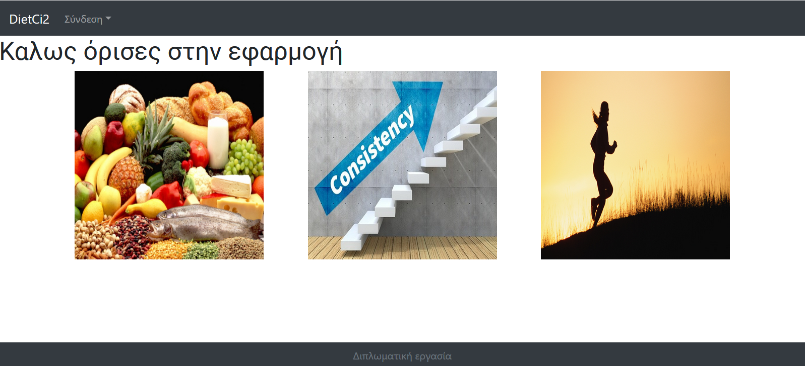
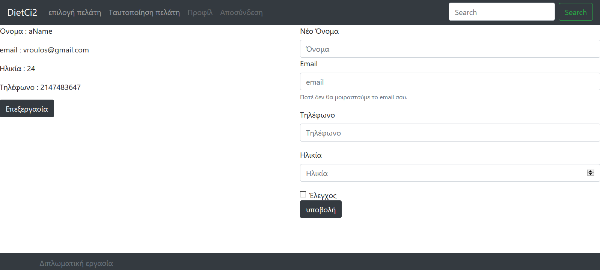
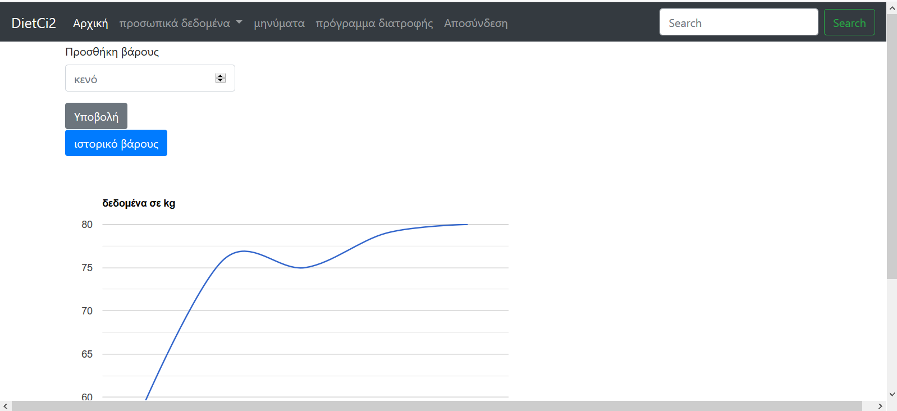

# diet_ci2
an application to track the body health of a person 

you will find the database in the diploma.sql . Import it in the phpMyadmin . 

To run it , download the data in 'xammp/htdocs' folder . After this http://localhost/diet_ci2/mywebapp/first URL is the index page

After you have to choose bettwen dietitian and customer . In case you choose the dietitian you must login . After you get into dietitian page . From there you can insert a diet programm to the customer. To send him a message. You have the ability to display your profile info and to proccess them .

If you select customer from index page you must also login . You can browse in the menu that you can put your weight history , read your messages and so on. 

There is also an app for android phone to use if you want (mynutricion)
